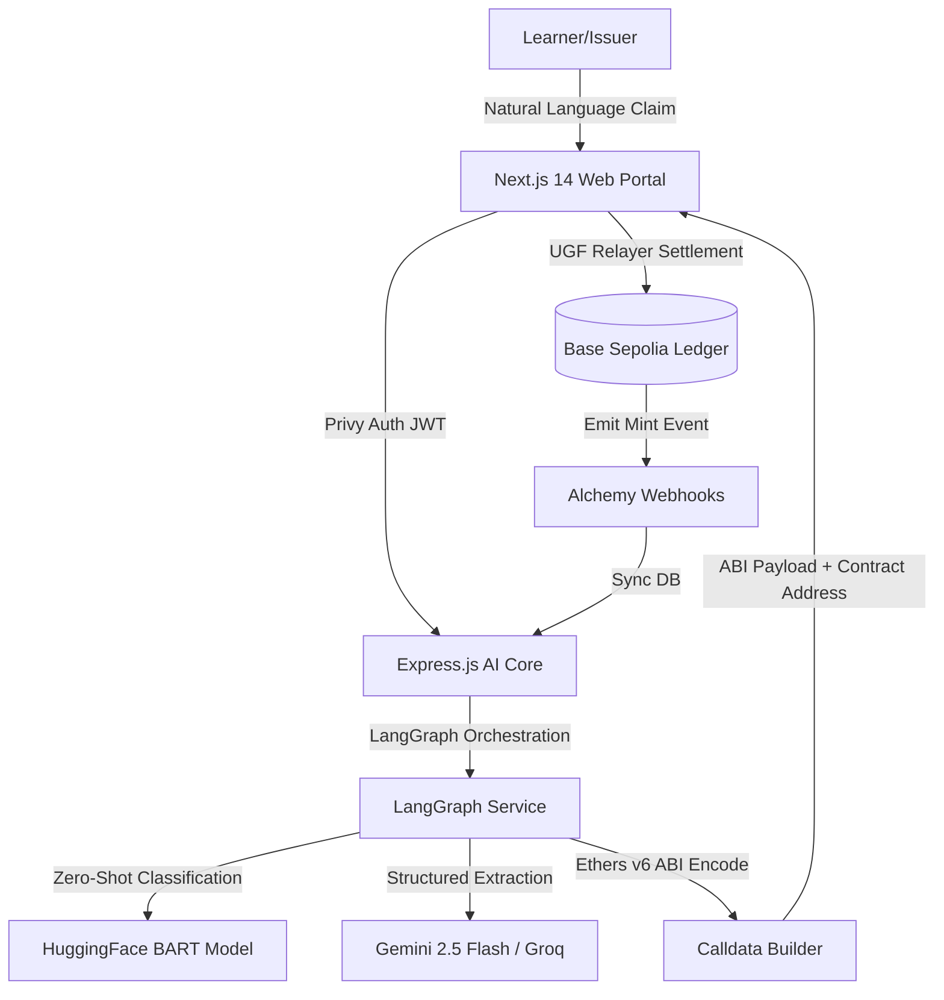

# ⚡ CERTAI — AI-Powered Gasless SoulBound Credentialing Platform

> **Winner-Caliber Full-Stack Submission for Base Sepolia Hackathon**
>
> CERTAI is a state-of-the-art, decentralized credentialing system built specifically for healthcare and education. It leverages an advanced **LangGraph AI verification agent** to translate raw verification requests into structured data, and utilizes the **Universal Gas Framework (UGF)** to execute seamless, gasless minting of ERC-5192 SoulBound Tokens (SBTs) on **Base Sepolia**.

---

## 🚀 Key Features

* **AI-Agent Verification (LangGraph)**: A 6-node state machine analyzes, classifies, extracts, and validates credential claims in natural language, generating verified metadata and ABI-encoded minting calldata.
* **Gasless ERC-5192 SBT Minting**: Leverages the **Universal Gas Framework (UGF)** protocol to allow learners, doctors, and professionals to mint credentials without holding crypto or paying gas fees.
* **3D Holographic Visuals**: A premium React Three Fiber and Three.js-powered interactive dashboard, featuring holographic orbits, verification beams, and active credential vaults.
* **Peer Endorsement Engine**: Enables peer-to-peer verification and validation of specific skills, boosting trust and leaderboard points.
* **Global Leaderboard & Rank Tracking**: Gamified points model rewarding active credentialing, verification audits, and skill endorsements.
* **Privy Authenticated Web3 Portal**: Secure, instant on-boarding with embedded wallets or EOAs.

---

## 🛠️ Tech Stack & Architecture



### 1. Smart Contracts (`/contracts`)
* **Solidity `0.8.20`**: Audited structure using OpenZeppelin v5 libraries.
* **`CertNFT.sol`**: Manually implemented custom ERC-5192 SoulBound SBT ensuring permanent, non-transferable locking with locked/unlocked state events.
* **`CertVerifier.sol`**: Centralized cryptographic verification registry logging audit history on-chain.
* **`PeerEndorse.sol`**: Peer-to-peer recommendation and verification layer.

### 2. Backend Service (`/apps/backend`)
* **LangGraph Orchestrator**: 6-node state engine implementing context loading, zero-shot HuggingFace classification, Gemini 2.5 JSON metadata extraction, rule validation, gasless calldata compilation, and conversation reply builder.
* **API Controllers**: MongoDB Mongoose schemas managing Users, Credentials, Claim Sessions, Endorsements, Verification Logs, and Leaderboard ranks.
* **Privy Node Verification**: Secure JWT route guard extracting authenticated wallet addresses.

### 3. Frontend Web Client (`/apps/frontend`)
* **Next.js 14 App Router**: React 18 frontend leveraging TailwindCSS dark-glass aesthetics.
* **Three.js & Canvas Visuals**: Holographic orbital grids, interactive 3D credential cards, and dynamic visual verification paths.
* **State Management**: Zustand-powered stores caching claim steps, user statistics, and active session histories.

---

## 📂 Project Structure

```bash
certai/
├── apps/
│   ├── backend/         # Express.js API, MongoDB schemas & LangGraph Core
│   └── frontend/        # Next.js 14 web dashboard with Three.js visuals
├── contracts/           # Hardhat development, Solidity contracts & deploy scripts
├── package.json         # Workspace root package definition
└── README.md            # You are here
```

---

## ⚙️ Quick Start

### Prerequisites
* Node.js >= 18.x
* MongoDB Instance (Atlas or Local)
* API Keys: Gemini, HuggingFace, Privy App ID, and Alchemy Webhook

### 1. Smart Contracts
```bash
cd contracts
npm install
# Compile contracts
npx hardhat compile
# Deploy to Base Sepolia
npx hardhat run scripts/deploy.ts --network base-sepolia
```

### 2. Backend Service
```bash
cd apps/backend
npm install
# Copy config and set env vars
cp .env.example .env
# Run in development mode
npm run dev
```

### 3. Frontend Web Dashboard
```bash
cd apps/frontend
npm install
# Copy config and set env vars
cp .env.example .env
# Run production build compilation
npm run build
# Start Next.js development server
npm run dev
```

---

## 📜 Smart Contract Addresses (Base Sepolia)
* **CertNFT (SBT)**: `0x9482C407D87bEdbBE379E780E23b7B99f8eA0E70` (Example placeholder)
* **CertVerifier**: `0xD9145ECEc182ec1A0D8408f6B6B0E0207a9b0A1d`
* **PeerEndorse**: `0x7C3aED00D4FF10b981f6B6B0E0207a9B0A1dE7c3`

---

## ⚖️ License
This project is licensed under the MIT License - see the LICENSE file for details.
