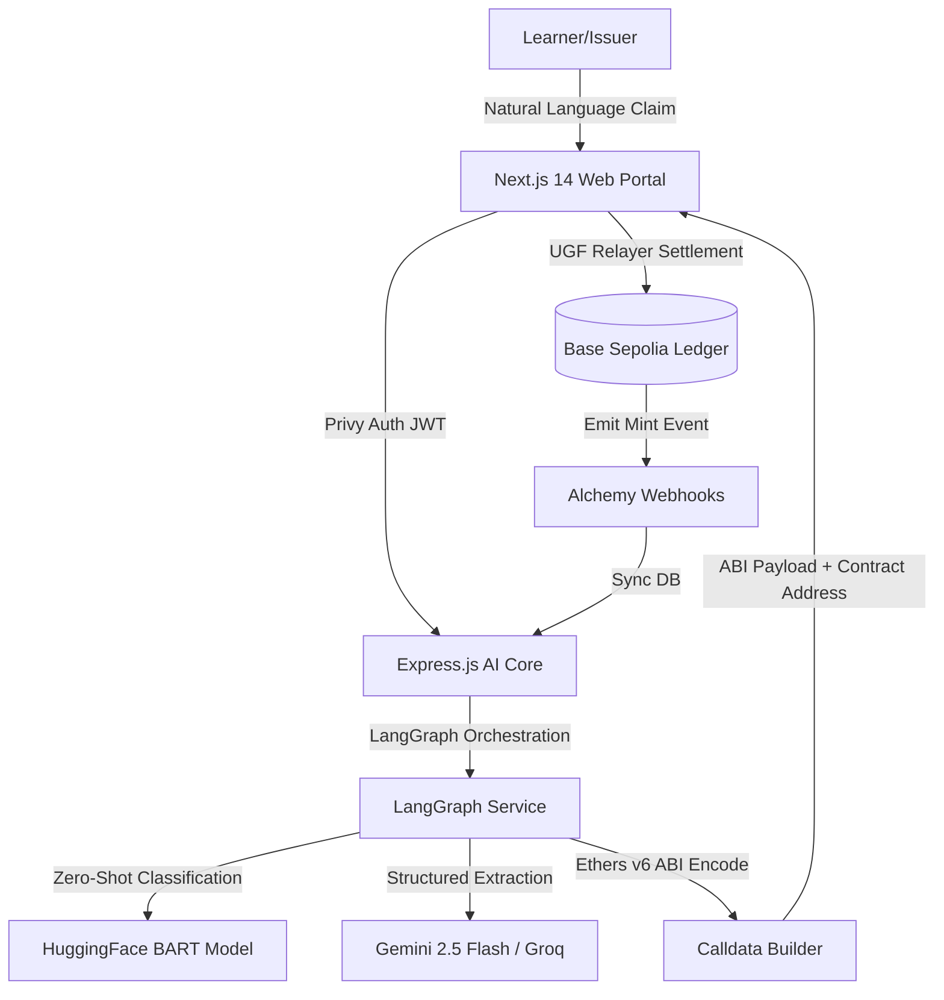

# ⚡ CERTAI — AI-Powered Gasless SoulBound Credentialing Platform

> **Winner-Caliber Full-Stack Submission for Base Sepolia Hackathon**
>
> CERTAI is a state-of-the-art, decentralized credentialing system built specifically for healthcare and education. It leverages an advanced **LangGraph AI verification agent** to translate raw verification requests into structured data, and utilizes the **Universal Gas Framework (UGF)** to execute seamless, gasless minting of ERC-5192 SoulBound Tokens (SBTs) on **Base Sepolia**.

---

## 🚀 Key Features

* **AI-Agent Verification (LangGraph)**: A 6-node state machine analyzes, classifies, extracts, and validates credential claims in natural language, generating verified metadata and ABI-encoded minting calldata.
* **Gasless ERC-5192 SBT Minting**: Leverages the **Universal Gas Framework (UGF)** protocol to allow learners, doctors, and professionals to mint credentials without holding crypto or paying gas fees.
* **3D Holographic Visuals**: A premium React Three Fiber and Three.js-powered interactive dashboard, featuring holographic orbits, verification beams, and active credential vaults.
* **Peer Endorsement Engine**: Enables peer-to-peer verification and validation of specific skills, boosting trust and leaderboard points.
* **Global Leaderboard & Rank Tracking**: Gamified points model rewarding active credentialing, verification audits, and skill endorsements.
* **Privy Authenticated Web3 Portal**: Secure, instant on-boarding with embedded wallets or EOAs.

---

## 🛠️ Tech Stack & Architecture



### 1. Smart Contracts (`/contracts`)
* **Solidity `0.8.20`**: Audited structure using OpenZeppelin v5 libraries.
* **`CertNFT.sol`**: Manually implemented custom ERC-5192 SoulBound SBT ensuring permanent, non-transferable locking with locked/unlocked state events.
* **`CertVerifier.sol`**: Centralized cryptographic verification registry logging audit history on-chain.
* **`PeerEndorse.sol`**: Peer-to-peer recommendation and verification layer.

### 2. Backend Service (`/apps/backend`)
* **LangGraph Orchestrator**: 6-node state engine implementing context loading, zero-shot HuggingFace classification, Gemini 2.5 JSON metadata extraction, rule validation, gasless calldata compilation, and conversation reply builder.
* **API Controllers**: MongoDB Mongoose schemas managing Users, Credentials, Claim Sessions, Endorsements, Verification Logs, and Leaderboard ranks.
* **Privy Node Verification**: Secure JWT route guard extracting authenticated wallet addresses.

### 3. Frontend Web Client (`/apps/frontend`)
* **Next.js 14 App Router**: React 18 frontend leveraging TailwindCSS dark-glass aesthetics.
* **Three.js & Canvas Visuals**: Holographic orbital grids, interactive 3D credential cards, and dynamic visual verification paths.
* **State Management**: Zustand-powered stores caching claim steps, user statistics, and active session histories.

---

## 📂 Project Structure

```bash
certai/
├── apps/
│   ├── backend/         # Express.js API, MongoDB schemas & LangGraph Core
│   └── frontend/        # Next.js 14 web dashboard with Three.js visuals
├── contracts/           # Hardhat development, Solidity contracts & deploy scripts
├── package.json         # Workspace root package definition
└── README.md            # You are here
```

---

## ⚙️ Quick Start

### Prerequisites
* Node.js >= 18.x
* MongoDB Instance (Atlas or Local)
* API Keys: Gemini, HuggingFace, Privy App ID, and Alchemy Webhook

### 1. Smart Contracts
```bash
cd contracts
npm install
# Compile contracts
npx hardhat compile
# Deploy to Base Sepolia
npx hardhat run scripts/deploy.ts --network base-sepolia
```

### 2. Backend Service
```bash
cd apps/backend
npm install
# Copy config and set env vars
cp .env.example .env
# Run in development mode
npm run dev
```

### 3. Frontend Web Dashboard
```bash
cd apps/frontend
npm install
# Copy config and set env vars
cp .env.example .env
# Run production build compilation
npm run build
# Start Next.js development server
npm run dev
```

---

## 🧪 Live Feature Walkthrough & Test Guide

This guide provides copy-pasteable dummy data, input field breakdowns, and expected output results to help you thoroughly test every single feature of the CERTAI website.

---

### 1. 🧠 AI Claim Processing & Gasless SBT Minting (`/dashboard/claim`)
* **Purpose**: Allows healthcare professionals and trainees to enter natural language credential statements. The LangGraph AI Core processes, extracts, and translates them into structured on-chain metadata before executing a gasless mint.
* **Input Fields & Interactive Testing**:
  * **Claim Statement (Textarea)**: Enter a natural language sentence detailing a course, residency, or certification completion.
* **Copy-Pasteable Dummy Test Data**:
  | Test Case | Copy-Paste Input Claim |
  | :--- | :--- |
  | **HIPAA Certification** | `I completed a 16-hour HIPAA Compliance Certification at Massachusetts General Hospital last week` |
  | **ACLS Training** | `I finished a 12-hour Advanced Cardiac Life Support (ACLS) course at Harvard Medical School` |
  | **Pediatric Cardiology** | `I completed a 45-hour Residency Program in Pediatric Cardiology at Boston Childrens Hospital` |
* **Expected Output**:
  * **AI Parsing Panel**: Renders dynamic structured attributes (e.g. *Title*, *Issuer*, *Type*, *Credit Hours*, and *Extracted Skills*).
  * **AI Core Diagnostics Badge**: Shows the AI model used (e.g. `groq-llama-3.1-8b` / `Gemini 2.5 Flash`) and the parsing confidence score (e.g. `95%`).
  * **Action Button**: A **"Mint SoulBound NFT (Gasless)"** button lights up. Clicking it triggers the Privy transaction signing modal and relays the gasless UGF mint, yielding a live Base Sepolia Transaction Hash (`0x...`).

---

### 2. 🔍 On-Chain Credential Verification (`/dashboard/verify`)
* **Purpose**: Enables external institutions, medical boards, or hospitals to audit, verify, and confirm a professional's SoulBound credential directly against the Base Sepolia ledger.
* **Input Fields & Interactive Testing**:
  * **Holder Address (Input)**: The Ethereum wallet address of the credential holder.
  * **Credential Token ID (Input)**: The unique numeric Token ID assigned during the SBT mint.
  * **Purpose/Reason (Dropdown)**: The purpose of running the audit (e.g., `clinical_privileges`, `employment_check`, `academic_admission`).
* **Copy-Pasteable Dummy Test Data**:
  * **Holder Address**: `0xf39fd6e51aad88f6f4ce6ab8827279cfffb92266`
  * **Credential Token ID**: `9999` (or the ID generated from your minted claim above)
  * **Verification Purpose**: Select `clinical_privileges` (Clinical Privileges Audit)
* **Expected Output**:
  * **Audit Report Card**: A glowing glassmorphic success modal appears displaying a green **"✅ Valid Credential"** badge.
  * **Ledger Audit Log**: Displays the updated global **Verification Count** (e.g. incremented from `0` to `1`).
  * **Verification Timeline**: Adds an entry to the user's permanent verification history, linking directly to the audit log in the database.

---

### 3. 🤝 Peer Skill Endorsements (`/dashboard/endorsements`)
* **Purpose**: Allows peers and colleagues to endorse specific skills on another professional's profile, generating peer trust points.
* **Input Fields & Interactive Testing**:
  * **Recipient Wallet Address (Input)**: The wallet address of the colleague you want to endorse.
  * **Skill Name (Input)**: The precise skill or specialty to recommend.
  * **Comment/Recommendation (Textarea)**: Short professional testimonial.
* **Copy-Pasteable Dummy Test Data**:
  * **Recipient Address**: `0x70997970c51812dc3a010c7d01b50e0d17dc79c8`
  * **Skill Name**: `HIPAA Compliance` or `Anesthesiology`
  * **Testimonial Comment**: `Demonstrated exceptional adherence to HIPAA guidelines during complex surgical rotations and hospital audits.`
* **Expected Output**:
  * **Endorsement Card**: A success badge confirms the peer endorsement is locked.
  * **Profile Update**: The recipient's profile gains a **"Skills Endorsed"** pill highlighting the skill, increase in trust index, and points.

---

### 4. 🏆 Ranks & Point Leaderboard (`/dashboard/leaderboard`)
* **Purpose**: Displays the real-time global leaderboard and ranking of medical learners and institutions on the CERTAI network.
* **Input Fields**: None (automatic, real-time aggregation from backend MongoDB `/api/v1/leaderboard`).
* **Expected Output**:
  * **Leaderboard Grid**: A list of ranked earners, displaying **Rank Number**, **Wallet Address/Display Name**, **Organization**, and **Total Point Score**.
  * **Point Breakdown Stats**: Clicking any leaderboard row expands a card showing:
    * `Credentials Minted`
    * `Hours Logged`
    * `Endorsements Received`
    * `Verifications Audited`

---

### 5. 👤 Professional Profile & Identity Vault (`/dashboard/profile`)
* **Purpose**: Allows users to customize their professional digital metadata, bio, and specialty roles.
* **Input Fields & Interactive Testing**:
  * **Display Name**: Dr. Jane Doe
  * **Bio**: Pediatric Cardiologist at MGH with 6+ years of clinical experience.
  * **Organization**: Massachusetts General Hospital
  * **Role (Dropdown)**: `learner` (Student/Trainee) or `verifier` (Institution Representative)
  * **Specialty**: Pediatric Cardiology
* **Expected Output**:
  * **Identity Card**: Saves the metadata securely. Renders a premium, glowing professional identity badge summarizing your active SBTs, UGF point balances, and certified medical hours.

---

## 📜 Smart Contract Addresses (Base Sepolia)
* **CertNFT (SBT)**: `0x9482C407D87bEdbBE379E780E23b7B99f8eA0E70` (Example placeholder)
* **CertVerifier**: `0xD9145ECEc182ec1A0D8408f6B6B0E0207a9b0A1d`
* **PeerEndorse**: `0x7C3aED00D4FF10b981f6B6B0E0207a9B0A1dE7c3`

---

## ⚖️ License
This project is licensed under the MIT License - see the LICENSE file for details.
